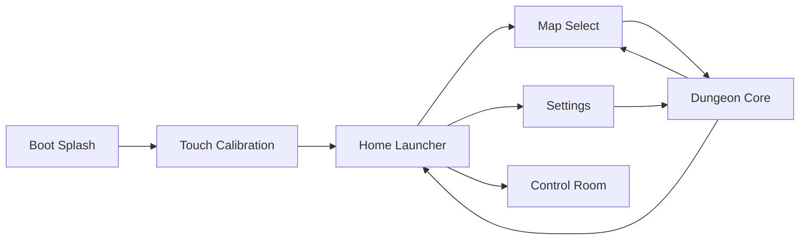

# FinalProject_RustMiniOS

Rust bare-metal MiniOS and 3D dungeon prototype for the shared `STM32F407ZG + 320x240 ILI9341 resistive-touch TFT` board.

This repository is intentionally separate from:

- `/Users/ivesliu/Documents/MCP2026/FinalProject_MiniOS`

## Overview

`FinalProject_RustMiniOS` is a touch-first embedded prototype that combines:

- a custom launcher-style MiniOS UI
- hardware control and touch calibration tools
- map selection and settings
- a textured software-raycast dungeon game

The goal of this project is not just to blink LEDs or display menus. It is to show that a small STM32 board can run a polished, Rust-driven interactive system with:

- multiple application screens
- bilingual UI
- configurable rendering quality
- live FPS reporting
- real gameplay with enemies, pickups, HUD, and weapon switching

## Current experience

The current playable build includes:

- animated boot splash
- mandatory touch calibration on startup
- launcher-style home screen
- `Map Select`
- `Settings`
- `Control Room`
- `Touch Calibration`
- `Dungeon Core` 3D prototype
- enemy movement and damage
- pickups and healing
- multi-weapon combat loop
- victory / defeat overlays
- FPS counter

## Hardware

| Item | Value |
| --- | --- |
| MCU | STM32F407ZG |
| Display | 320x240 ILI9341 |
| LCD bus | FSMC / 8080-style parallel |
| Touch | Single-point resistive touch |
| Rust target | `thumbv7em-none-eabihf` |

## System architecture



## Source layout

- `src/main.rs`
  - top-level MiniOS flow, screen switching, calibration state, FPS sampling
- `src/ui.rs`
  - Home, Map Select, Settings, Touch Calibration, Control Room
- `src/dungeon.rs`
  - gameplay, software raycasting, HUD, touch controls, overlays
- `src/dungeon/data.rs`
  - map layouts, enemy spawns, pickup spawns
- `src/dungeon/weapon.rs`
  - weapon definitions and tuning
- `src/dungeon/strategy.rs`
  - render quality profiles
- `src/touch.rs`
  - resistive touch sampling, filtering, calibration
- `src/display.rs`
  - display helpers and RGB565 upload bridge
- `c_support/`
  - reused STM32 clock init and TFT driver code through FFI
- `assets/`
  - curated textures, converted RGB565 data, and reference art
- `preview/`
  - lightweight browser preview used during UI iteration
- `tools/`
  - helper scripts such as font generation

## Major features

### MiniOS shell

- touch-first launcher
- dark / light theme support
- English / Traditional Chinese toggle
- touch calibration workflow
- board interaction and status page

### Dungeon Core

- textured wall rendering
- floor / ceiling rendering
- enemy sprites with depth-based occlusion
- weapon switching
- pickups and healing
- HUD, FPS counter, and overlays
- multiple maps

## Render strategy

The project currently supports three render profiles:

| Mode | Purpose | Current behavior |
| --- | --- | --- |
| `QUALITY` | best visual quality | full floor / ceiling detail |
| `BALANCED` | default mode | lower floor / ceiling cost with similar look |
| `PERFORMANCE` | highest speed | lower-cost wall and floor rendering |

This setting is live in the system UI and is intended to show the tradeoff between image quality and performance on STM32-class hardware.

## Controls

### Startup

- system boots into `Touch Calibration`
- tap five calibration targets in order
- after calibration, the system enters `Home`

### Home

- `K0`: previous card
- `WKUP`: next card
- `K1`: open selected card
- touch: tap a card directly

### Settings

- theme toggle
- English / Traditional Chinese toggle
- render strategy cycle

### Dungeon Core

- left virtual joystick: move / turn
- right virtual button: fire
- `WKUP + K1`: next weapon
- `K0 + K1`: previous weapon
- tap the center weapon chip: cycle weapon
- hold `K0 + WKUP`: return

## Build

```bash
cd /Users/ivesliu/Documents/MCP2026/FinalProject_RustMiniOS
cargo build --release
```

## Flash

```bash
cd /Users/ivesliu/Documents/MCP2026/FinalProject_RustMiniOS
cargo run --release
```

## Environment notes

- the project expects PlatformIO packages under the default `~/.platformio/packages`
- if your PlatformIO packages live elsewhere, set:

```bash
export PLATFORMIO_PACKAGES_DIR=/your/path/to/.platformio/packages
```

## Notes

- touch is resistive single-touch, not true multi-touch
- Chinese glyph data is generated into `src/font_zh.rs`
- this repository does not modify `/Users/ivesliu/Documents/MCP2026/FinalProject_MiniOS`
