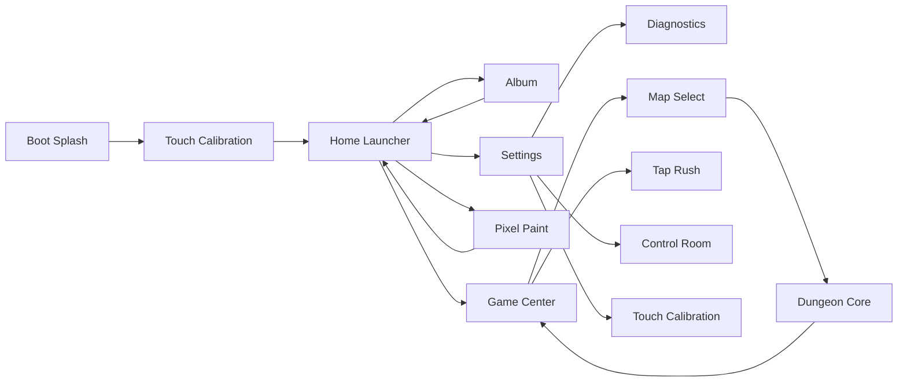

# FinalProject_RustMiniOS

Rust bare-metal MiniOS and 3D dungeon prototype for the shared `STM32F407ZG + 320x240 ILI9341 resistive-touch TFT` board.

This repository is intentionally separate from:

- `/Users/ivesliu/Documents/MCP2026/FinalProject_MiniOS`

## Overview

`FinalProject_RustMiniOS` is a touch-first embedded prototype that combines:

- a structured desktop-style MiniOS shell
- an embedded album with an optional `Mac companion` path
- a game center with dungeon and arcade slots
- a retro pixel paint app
- hardware control and touch calibration tools
- a textured software-raycast dungeon game

The goal of this project is not just to blink LEDs or display menus. It is to show that a small STM32 board can run a polished, Rust-driven interactive system with:

- multiple application screens
- bilingual UI
- configurable rendering quality
- live FPS reporting
- real gameplay with enemies, pickups, HUD, and weapon switching

## Current experience

The current playable build includes:

- animated boot splash
- mandatory touch calibration on startup
- desktop-style home launcher
- `Album`
- `Game Center`
- `Pixel Paint`
- `Settings`
- `Control Room`
- `Touch Calibration`
- `Tap Rush` microgame
- `Map Select`
- `Dungeon Core` 3D prototype
- processed media pipeline for stills and GIF clips
- enemy movement and damage
- pickups and healing
- multi-weapon combat loop
- victory / defeat overlays
- FPS counter

## Hardware

| Item | Value |
| --- | --- |
| MCU | STM32F407ZG |
| Display | 320x240 ILI9341 |
| LCD bus | FSMC / 8080-style parallel |
| Touch | Single-point resistive touch |
| Rust target | `thumbv7em-none-eabihf` |

## System architecture



## Source layout

- `src/main.rs`
  - minimal board bring-up, boot handoff, and main frame loop
- `src/shell.rs`
  - MiniOS shell state, screen enum, and module wiring
- `src/shell/update.rs`
  - screen routing, input handling, lifecycle transitions, and launcher logic
- `src/shell/render.rs`
  - shell-level rendering, redraw orchestration, and boot splash
- `src/shell/persistence.rs`
  - persisted state restore/save hooks and app/system snapshot building
- `src/shell/calibration.rs`
  - touch calibration workflow and affine solve helpers
- `src/app_registry.rs`
  - app metadata, launcher groupings, and shared launch registry
- `src/apps/`
  - structured app modules for Album, Game Center, Paint, and Tap Rush
- `src/companion.rs`
  - USART3-based Mac companion link, runtime catalog sync, and Album frame cache
- `src/media.rs`
  - optional embedded still / motion clip registry generated at build time
- `src/storage.rs`
  - persisted system settings plus app save data stored in reserved MCU flash
- `src/system_info.rs`
  - runtime/build metadata helpers for About, diagnostics, and safe-mode messaging
- `src/ui.rs`
  - shell UI entry module and shared constants
- `src/ui/`
  - split shell screens such as Home, Map Select, Settings, Diagnostics, Calibration, and Control Room
- `src/dungeon.rs`
  - dungeon state, constants, and public entry points
- `src/dungeon/data.rs`
  - map layouts, enemy spawns, pickup spawns
- `src/dungeon/update.rs`
  - dungeon gameplay update loop, combat, pickups, and AI movement
- `src/dungeon/render.rs`
  - dungeon render entry point and render-module wiring
- `src/dungeon/render/viewport.rs`
  - wall-raycast orchestration and viewport upload
- `src/dungeon/render/floor.rs`
  - ceiling and floor rendering
- `src/dungeon/render/sprites.rs`
  - enemy and pickup sprite rendering
- `src/dungeon/render/controls.rs`
  - touch-stick and fire-button overlay rendering
- `src/dungeon/render/hud.rs`
  - HUD, minimap, and overlayed status bars
- `src/dungeon/render/effects.rs`
  - muzzle flash and heal burst FX
- `src/dungeon/render/weapon.rs`
  - first-person weapon rendering
- `src/dungeon/math.rs`
  - collision tests, ray casting, view-space helpers, and utility math
- `src/dungeon/weapon.rs`
  - weapon definitions and tuning
- `src/dungeon/strategy.rs`
  - render quality profiles
- `src/touch.rs`
  - resistive touch sampling, filtering, calibration
- `src/display.rs`
  - display helpers and RGB565 upload bridge
- `c_support/`
  - reused STM32 clock init and TFT driver code through FFI
- `assets/`
  - curated textures, converted RGB565 data, and reference art
- `preview/`
  - lightweight browser preview used during UI iteration
- `tools/`
  - helper scripts such as font generation and media preprocessing
- `docs/`
  - engineering notes such as memory / `.bss` debugging writeups
  - runtime validation notes such as the board smoke checklist
- `mac_companion/`
  - Mac-side serial host that serves processed Album media over `USART3`

## Major features

### MiniOS shell

- desktop-style launcher
- registry-driven app launch flow
- split shell modules for update / render / persistence / calibration
- dark / light theme support
- English / Traditional Chinese toggle
- album and motion-clip entry point
- game center routing
- pixel paint app
- touch calibration workflow
- board interaction and status page
- diagnostics page for runtime inspection
- dedicated About screen with build/profile/media summaries
- safe-mode boot path for minimal recovery startup
- persisted theme / language / render strategy / touch calibration
- app save data for Album, Pixel Paint, and arcade high scores
- storage maintenance tools for `Clear Save Data` and `Factory Reset`
- host-side verification crate for storage / registry / media invariants
- optional Mac companion Album pipeline for future flash optimization
- build metadata shown in-system for demos and debugging

### Dungeon Core

- textured wall rendering
- floor / ceiling rendering
- enemy sprites with depth-based occlusion
- weapon switching
- pickups and healing
- HUD, FPS counter, and overlays
- multiple maps
- modular render pipeline split across viewport / floor / sprites / HUD / effects

## Render strategy

The project currently supports three render profiles:

| Mode | Purpose | Current behavior |
| --- | --- | --- |
| `QUALITY` | best visual quality | full floor / ceiling detail |
| `BALANCED` | default mode | lower floor / ceiling cost with similar look |
| `PERFORMANCE` | highest speed | lower-cost wall and floor rendering |

This setting is live in the system UI and is intended to show the tradeoff between image quality and performance on STM32-class hardware.

## Media pipeline

Test media lives under:

- `assets/test_media/images`
- `assets/test_media/gifs`

Run:

```bash
cd /Users/ivesliu/Documents/MCP2026/FinalProject_RustMiniOS
./tools/process_test_media.sh
```

The script generates:

- `320x240` preview PNG/GIF outputs for review
- low-resolution `RGB565` assets for the embedded Album and optional Mac companion build
- manifest files used by the build script to auto-register media

The default firmware build embeds Album stills and motion clips into the MCU image.

If you want the lighter `Mac companion` build instead:

```bash
cd /Users/ivesliu/Documents/MCP2026/FinalProject_RustMiniOS
MINIOS_EMBED_ALBUM=0 cargo build --release
```

## Verification

Host-side checks live in:

- `host_checks/`

Run them with:

```bash
cd /Users/ivesliu/Documents/MCP2026/FinalProject_RustMiniOS/host_checks
cargo test
```

This suite verifies:

- storage encode / decode and checksum rejection
- app registry slot mappings
- converted media manifests against firmware assets

For board validation, use:

- [docs/smoke-test-checklist.md](/Users/ivesliu/Documents/MCP2026/FinalProject_RustMiniOS/docs/smoke-test-checklist.md)
- [docs/mac-companion.md](/Users/ivesliu/Documents/MCP2026/FinalProject_RustMiniOS/docs/mac-companion.md)

## Controls

### Startup

- first boot enters `Touch Calibration`
- after a successful save, later boots restore settings and go straight to `Home`
- if no valid calibration is stored, tap five calibration targets in order

### Home

- `K0`: previous card
- `WKUP`: next card
- `K1`: open selected card
- touch: tap a card directly

### Album

- `K0`: previous still / clip
- `WKUP`: next still / clip
- `K1`: switch between `Still` and `Motion`
- touch: tap tabs or tap motion media to pause / play

### Game Center

- `K0`: previous game slot
- `WKUP`: next game slot
- `K1`: open selected game

### Pixel Paint

- touch drag: paint pixels
- `K0`: previous color
- `WKUP`: next color
- `K1`: clear canvas

### Settings

- `K0 / WKUP`: move selection
- `K1`: apply selected option
- touch: tap an option directly

### Diagnostics

- view active screen, FPS, storage validity, recent app, and save presence
- `K0 / WKUP`: switch storage maintenance action
- `K1`: confirm `Clear Save Data` or `Factory Reset` with a second press
- use back navigation to return to `Settings`

### Dungeon Core

- left virtual joystick: move / turn
- right virtual button: fire
- `WKUP + K1`: next weapon
- `K0 + K1`: previous weapon
- tap the center weapon chip: cycle weapon
- hold `K0 + WKUP`: return

## Build

```bash
cd /Users/ivesliu/Documents/MCP2026/FinalProject_RustMiniOS
cargo build --release
```

## Flash

```bash
cd /Users/ivesliu/Documents/MCP2026/FinalProject_RustMiniOS
cargo run --release
```

## Environment notes

- the project expects PlatformIO packages under the default `~/.platformio/packages`
- if your PlatformIO packages live elsewhere, set:

```bash
export PLATFORMIO_PACKAGES_DIR=/your/path/to/.platformio/packages
```

## Notes

- touch is resistive single-touch, not true multi-touch
- Chinese glyph data is generated into `src/font_zh.rs`
- build-time media registration is generated from `assets/test_media/converted`
- this repository does not modify `/Users/ivesliu/Documents/MCP2026/FinalProject_MiniOS`

## Engineering notes

- `.bss` / RAM debugging record: [docs/bss-debugging-notes.md](/Users/ivesliu/Documents/MCP2026/FinalProject_RustMiniOS/docs/bss-debugging-notes.md)
- storage / flash diagnostics note: [docs/storage-diagnostics-notes.md](/Users/ivesliu/Documents/MCP2026/FinalProject_RustMiniOS/docs/storage-diagnostics-notes.md)
- flash usage analysis: [docs/flash-usage-analysis-2026-03-16.md](/Users/ivesliu/Documents/MCP2026/FinalProject_RustMiniOS/docs/flash-usage-analysis-2026-03-16.md)
- Mac companion setup note: [docs/mac-companion.md](/Users/ivesliu/Documents/MCP2026/FinalProject_RustMiniOS/docs/mac-companion.md)
- repo module boundary note: [docs/repo-architecture.md](/Users/ivesliu/Documents/MCP2026/FinalProject_RustMiniOS/docs/repo-architecture.md)
